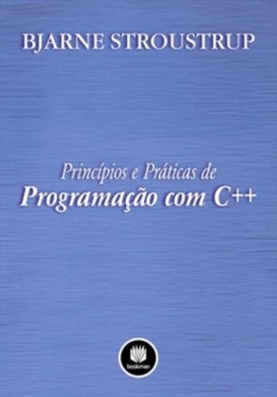

# Programação em C++

Prof. Eduardo Ono

 

## Bibliografia

| | Descrição |
| :-: | --- |
|  | [STROUSTRUP_2012]   STROUSTRUP, Bjarne; [__Princípios e Práticas de Programação com C++__](https://archive.org/details/principios-e-praticas-de-programacao-com-c-by-bjarne-stroustrup-z-lib.org), Porto Alegre: Bookman, 2012.

 
